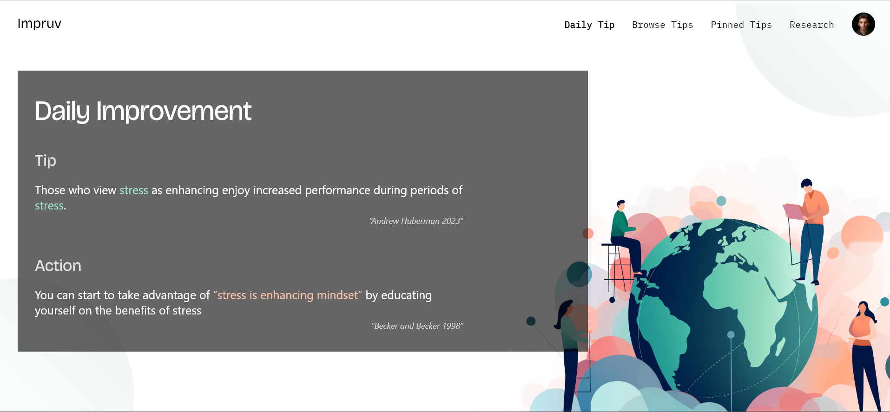

# Impruv 

React and TypeScript based UI concept geared toward productivity tips and mental health outcomees.




<!-- image below -->

---

## Getting Started

### Prerequisites

- [Node.js](https://nodejs.org/en/)
- [NPM](https://www.npmjs.com/)
- [React](https://reactjs.org/)
- [TypeScript](https://www.typescriptlang.org/)

### Running locally

1. Clone the repo

```sh
git clone
```

2. Install NPM packages

```sh
npm install
```

3. Start the app

```sh
npm start
```

